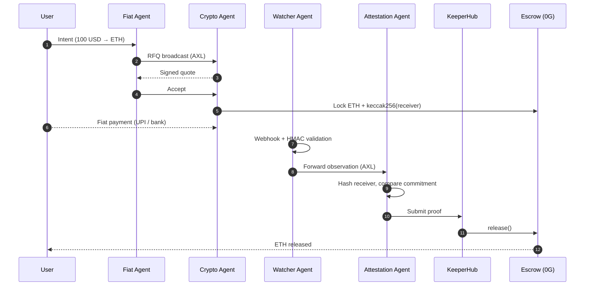
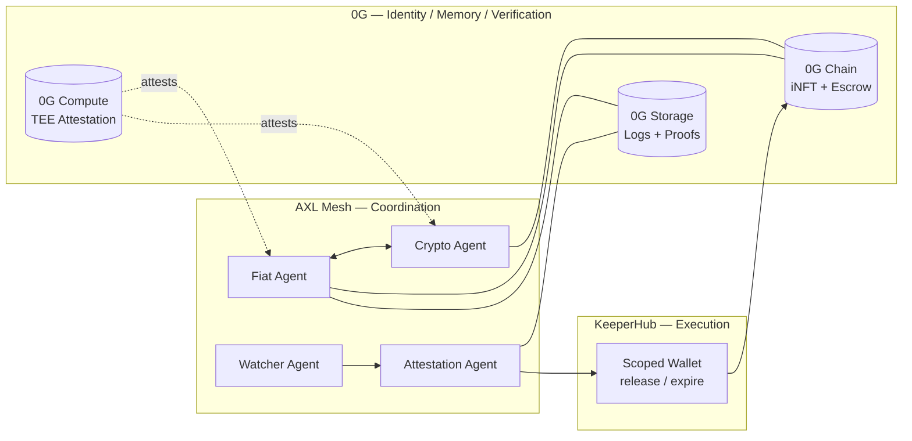

<p align="center">
  
</p>

<h1 align="center">Aegis</h1>

<p align="center">
  <strong>The first fiat-to-crypto onramp with no operator</strong><br/>
  Autonomous agents. No custodians. No central coordinator.
</p>

<p align="center">
  
  
  
  
</p>

<p align="center">
  <a href="https://aegis-ten-hazel.vercel.app">Live Demo</a> ·
  <a href="#how-it-works">How It Works</a> ·
  <a href="#architecture">Architecture</a> ·
  <a href="#local-development">Run Locally</a>
</p>

---

## Overview

Aegis is the first fiat-to-crypto onramp operated by no one. A four-agent autonomous swarm — Fiat, Crypto, Watcher, Attestation — discovers each other peer-to-peer, negotiates quotes through sealed inference, verifies off-chain payments, and triggers on-chain settlement. Each agent has structurally different powers, so that **no single agent can move funds alone**.

- **Peer-to-peer coordination** — agents discover and negotiate over an encrypted mesh (Gensyn AXL)
- **Identity, memory, verification** — stateful, self-evolving agents with verifiable binaries (0G Chain + Storage + Compute)
- **Bounded execution** — a scoped wallet that's the only thing that can move funds (KeeperHub)

---

## The Problem

Every fiat-to-crypto onramp today is centralized. They custody funds, control liquidity, and can freeze accounts.

> **The gateway to decentralization is still centralized.**

Aegis removes that gateway by replacing operators with verifiable agent coordination and constrained execution.


---

## How It Works

> Scenario: you want to swap **100 USD → ETH**.

1. **Connect Wallet** — you receive two agents (Fiat + Crypto), minted as iNFTs (ERC-7857) on 0G Chain with persistent memory on 0G Storage.
2. **Quote Discovery** — your Fiat Agent broadcasts an RFQ across the AXL mesh; LP Crypto Agents reply with signed quotes; the best is selected deterministically.
3. **Escrow Lock** — the LP locks ETH into escrow and commits `keccak256(paymentReceiver)`. The receiver commitment is immutable.
4. **Fiat Payment** — you pay via UPI / bank transfer.
5. **Webhook Observation** — the Watcher Agent validates the HMAC and forwards the observation. It **cannot execute**.
6. **Verification** — the Attestation Agent hashes the observed receiver and compares it to the on-chain commitment.
7. **Evidence + Execution** — proof is pinned to 0G Storage; KeeperHub executes `release()`; ETH is sent to the user.

**Result:** no custody, no trust — only verifiable coordination.

---

## Architecture

### Settlement Flow



### System Components



---

## The Four Agents

| Agent | Role | Trust Property |
|---|---|---|
| **Fiat Agent** | Broadcasts intent, selects quotes | No custody |
| **Crypto Agent** | Provides liquidity, locks funds | Funds in escrow |
| **Watcher Agent** | Observes off-chain payments | Cannot execute |
| **Attestation Agent** | Verifies + triggers release | Cannot fabricate |

> Compromising any single agent is insufficient to steal funds.

---

## Sponsor Integrations

### 0G — Agent Execution Environment

| Layer | Use |
|---|---|
| **0G Chain** | Agents minted as iNFTs (ERC-7857) with embedded intelligence; escrow contract enforces receiver commitments and deterministic release |
| **0G Storage** | KV memory for real-time agent state + Log memory for full settlement history; decision logs, quote history, LP reputation priors — encrypted and Merkle-rooted for auditability and federated reputation learning |
| **0G Compute** | Sealed inference (TEE-attested LLM calls) for quote ranking and counterparty reputation scoring; agent binary attestation ensures canonical, untampered execution |

Agents are self-evolving: every settlement updates the reputation graph through federated learning, and the swarm continuously improves quote selection and counterparty reliability scoring across sessions via 0G Storage-backed memory.

### Gensyn AXL — Coordination Layer

No backend, no broker, no relay. Each agent runs on its own node.

| Layer | Use |
|---|---|
| **Messaging** | Peer-to-peer, end-to-end encrypted, routed over Yggdrasil mesh |
| **MCP** | Agents expose dynamic capabilities (`get_quote`, `verify_payment`, `check_reputation`); other agents call them without hardcoded integrations |
| **Result** | A buyer in Germany and an LP in India discover, negotiate, and settle without shared infrastructure |

### KeeperHub — Execution Boundary

Agents reason; KeeperHub executes.

| Trigger | Action |
|---|---|
| **Wallet scope** | Embedded wallet strictly scoped to `release()` and `expire()` |
| **Valid proof** | Webhook → Watcher → Attestation → KeeperHub executes `release()` |
| **Timeout** | KeeperHub executes `expire()` |

> Agents cannot move funds. KeeperHub cannot execute invalid actions. Workflow logic cannot exceed permissions.

---

## Key Security Primitive — Receiver Commitment Binding

```text
At lock:         commitment = keccak256(paymentReceiver)
At verification: keccak256(observedReceiver) == commitment ?
```

Only matching values trigger release. This prevents payment spoofing and bait-and-switch attacks.

```text
  LOCK TIME                          VERIFY TIME
  ─────────                          ───────────
  receiver: alice@upi               observed: alice@upi
        │                                 │
        ▼                                 ▼
   keccak256()                       keccak256()
        │                                 │
        ▼                                 ▼
  ┌──────────┐    ==  match  ==>   ┌──────────┐
  │ 0xa3f1.. │ <─────────────────> │ 0xa3f1.. │   ✅ release()
  └──────────┘                     └──────────┘
                  ≠  mismatch              ❌ revert
```

---

## Deployed Contracts

| Contract | Address | Purpose |
|---|---|---|
| Escrow | `0xeAD29cBfAb93ed51808D65954Dd1b3cDDaDA1348` | Settlement |
| AgentRegistry | `0x2E124DEaeD3Ba3b063356F9b45617d862e4b9dB5` | Agent keys |
| RailRegistry | `0x0a22b6e2f0ac6cDA83C04B1Ba33aAc8e9Df6aed7` | Payment config |
| AgentINFT | `0xBf173825A08a98a0288923d00919daC13C94C70A` | Agent identity (ERC-7857) |
| TestERC20 | `0x5F2577675beD125794FDfc44940b62D60BF00F81` | Test token |

---

## Local Development

```bash
git clone https://github.com/arko05roy/Aegis.git && cd Aegis
pnpm install
cp .env.example .env

# Start AXL nodes
cd services/axl-node
./node -config node-config.json &
./node -config node-config-2.json &

# Start agent + webhook services
pnpm run agent-server &
pnpm run webhook-receiver &

# Start frontend
pnpm dev
```

Live demo: **https://aegis-ten-hazel.vercel.app**

---

## Sponsor Feedback

<details>
<summary><strong>0G</strong></summary>

- Unclear Indexer / MemData relationship
- Missing Merkle retrieval examples
- Compute broker silent failures
</details>

<details>
<summary><strong>Gensyn AXL</strong></summary>

- HTTP bridge undocumented
- Unclear message size limits
- MCP routing unspecified
</details>

<details>
<summary><strong>KeeperHub</strong></summary>

- Webhook schema unclear
- Wallet scoping unclear
- Missing iteration tools
</details>

---

## Team

**Arko Roy** — [Telegram](https://t.me/arkoroy) · [X](https://x.com/arko05roy)

---

## License

MIT
