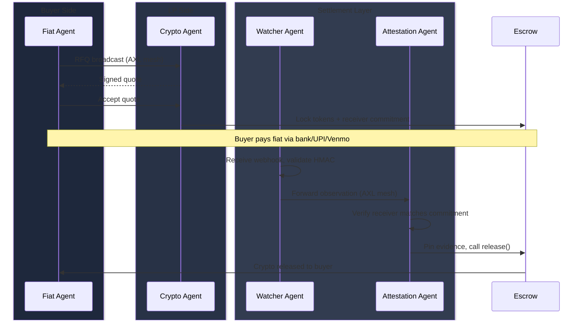
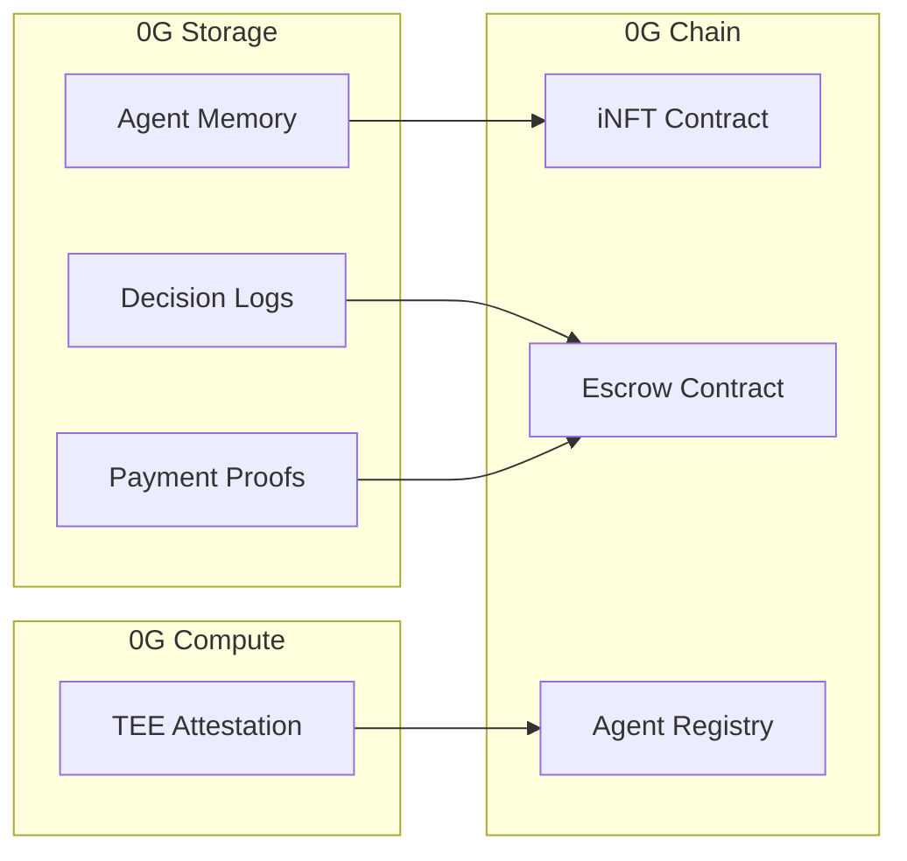
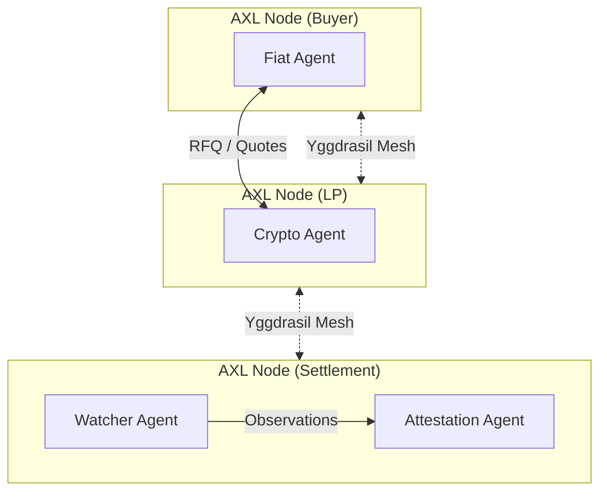
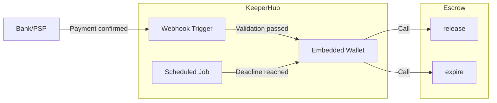

<p align="center">
  
</p>

<h1 align="center">Aegis</h1>

<p align="center">
  <strong>The First Decentralized Fiat-to-Crypto Onramp</strong><br/>
  Four autonomous agents. Zero custodians. Pure P2P settlement.
</p>

<p align="center">
  
  
  
</p>

---

## The Problem

Every fiat-to-crypto onramp today is centralized. They custody your funds, control the orderbook, and can freeze accounts at will.

**The gateway to decentralization is centralization.**

Aegis removes the gateway entirely. P2P negotiation, on-chain escrow, no middleman.

---

## How It Works

> **You want to swap 100 USD for ETH.**

1. **Connect Wallet** — You get two AI agents: a *Fiat Agent* (handles buying) and a *Crypto Agent* (handles selling). These are minted as an iNFT on 0G Chain with memory stored on 0G Storage.

2. **Quote Discovery** — Your Fiat Agent broadcasts the swap intent across the **AXL mesh**. LP Crypto Agents respond with signed quotes. Your agent scores them and picks the best.

3. **Escrow Lock** — The LP's Crypto Agent locks ETH into the Escrow contract on **0G Chain**. At lock time, they commit `keccak256(paymentReceiver)` — this hash is immutable.

4. **Fiat Payment** — You pay the LP via UPI / Venmo / bank transfer. The payment reference includes your order ID.

5. **Webhook Observation** — Bank confirms payment, fires webhook. The **Watcher Agent** validates HMAC signature but *cannot release* — only forwards to the Attestation Agent.

6. **Commitment Verification** — The **Attestation Agent** hashes the observed receiver and checks it against the on-chain commitment. Mismatch = order fails. Match = continue.

7. **Evidence & Release** — Attestation pins proof to **0G Storage**, triggers release via **KeeperHub**. ETH moves to your wallet.

**Four agents. None can act alone. Crypto moves only when the math checks out.**



---

## The Four Agents

| Agent | Role | Trust Property |
|-------|------|----------------|
| **Fiat Agent** | Broadcasts buyer intent, selects best quote | No custody, no signing authority |
| **Crypto Agent** | Provides liquidity, locks tokens in escrow | Funds held in contract, not agent |
| **Watcher Agent** | Observes payment webhooks, validates HMAC | Cannot release — only forwards |
| **Attestation Agent** | Verifies observations, pins proofs, triggers release | Cannot release without valid evidence |

**Key insight:** Compromise one agent and you still can't steal funds. The attack surface requires compromising multiple agents plus the LP's bank webhook source.

---

## How Aegis Uses 0G

Each user's agent pair (Fiat + Crypto) is minted as an **iNFT** on 0G Chain. The agent's memory, decision history, and learned LP preferences are stored encrypted on **0G Storage**. Transfer the NFT and the new owner inherits a trained agent with provable track record — not a blank slate.



**Storage** pins every agent decision and payment proof with Merkle roots. Anyone can verify your agent picked the best quote — not a manipulated one.

**Compute** attests agent code via TEE before each session. Users know they're running canonical binaries, not tampered versions skimming fees.

**Chain** hosts the Escrow contract with receiver commitment binding. When an LP locks tokens, they commit a hash of their payment receiver. The Attestation Agent verifies the observed receiver matches before releasing.

---

## How Aegis Uses Gensyn AXL

All four agents communicate exclusively over AXL's encrypted P2P mesh. When a buyer wants to swap, their Fiat Agent broadcasts an RFQ. LP Crypto Agents respond with signed quotes. When payment is confirmed, the Watcher forwards observations to the Attestation Agent — all peer-to-peer, all end-to-end encrypted.



Each user runs their own AXL node. Messages traverse the actual mesh between distinct OS processes. There's no central point to censor, surveil, or shut down.

MCP tools are exposed over the mesh — any agent can call another agent's capabilities without hardcoded integrations.

---

## How Aegis Uses KeeperHub

Agents reason, but they hit a wall when they need to move value. KeeperHub is the execution layer — the agents negotiate and validate, KeeperHub executes the on-chain calls.



The **embedded wallet** is scoped to exactly two functions: `release()` and `expire()`. Even if workflow logic is compromised, the wallet cannot drain funds.

**Payment release**: When a bank webhook confirms payment, KeeperHub forwards to the Watcher, which validates HMAC and passes to the Attestation Agent. After evidence is pinned and commitments verified, KeeperHub executes release.

**Deadline enforcement**: A scheduled workflow monitors for orders past deadline. If buyers ghost, KeeperHub calls expire — refunding the LP and slashing the anti-grief bond.

---

## Settlement Flow

```
1. Buyer           "swap 100 USD → ETH"           Fiat Agent
                                                      │
2. Fiat Agent      RFQ broadcast (AXL)            Crypto Agents
                                                      │
3. Crypto Agents   Signed quotes (AXL)            Fiat Agent
                                                      │
4. Fiat Agent      Accept best quote              Crypto Agent
                                                      │
5. Crypto Agent    Lock tokens + commitment       Escrow Contract
                                                      │
   ══════════════════════════════════════════════════════════
   │  CRYPTO LOCKED  │  RECEIVER COMMITTED ON-CHAIN  │
   ══════════════════════════════════════════════════════════
                                                      │
6. Buyer           Pay fiat                       Bank/PSP
                                                      │
7. Bank/PSP        Webhook                        Watcher Agent
                                                      │
8. Watcher         Validate HMAC, forward         Attestation Agent
                                                      │
9. Attestation     Verify commitment match        (internal)
                                                      │
10. Attestation    Pin evidence                   0G Storage
                                                      │
11. Attestation    Trigger release                KeeperHub
                                                      │
12. KeeperHub      Execute release()              Escrow Contract
                                                      │
13. Escrow         Crypto released                Buyer Wallet
```

---

## Key Security Primitive

**Receiver Commitment Binding**

When an LP locks tokens, they commit `keccak256(paymentReceiver)` on-chain. This hash is immutable.

When the buyer pays and the bank fires a webhook, the Watcher extracts the actual receiver. The Attestation Agent hashes it and checks against the on-chain commitment. Release proceeds only if they match.

This prevents bait-and-switch attacks where LPs show fake payment details and claim the buyer never paid.

---

## Deployed Contracts

| Contract | 0G Galileo | Description |
|----------|------------|-------------|
| Escrow | `0xeAD29cBfAb93ed51808D65954Dd1b3cDDaDA1348` | Holds locked crypto during settlement |
| AgentRegistry | `0x2E124DEaeD3Ba3b063356F9b45617d862e4b9dB5` | Registers agent pubkeys on-chain |
| RailRegistry | `0x0a22b6e2f0ac6cDA83C04B1Ba33aAc8e9Df6aed7` | Payment rail configuration |
| AgentINFT (ERC-7857) | `0xBf173825A08a98a0288923d00919daC13C94C70A` | Tokenizes agents as iNFTs |
| TestERC20 | `0x5F2577675beD125794FDfc44940b62D60BF00F81` | Test token for escrow |

---

## Local Development

```bash
git clone https://github.com/arko05roy/Aegis.git && cd Aegis
pnpm install
cp .env.example .env  # add PRIVATE_KEY, INFT_CONTRACT_ADDRESS

# Start AXL nodes
cd services/axl-node
./node -config node-config.json &
./node -config node-config-2.json &

# Start backend
pnpm run agent-server &
pnpm run webhook-receiver &

# Start frontend
pnpm dev
```

---

## Demo

**Live:** [aegis-ten-hazel.vercel.app](https://aegis-ten-hazel.vercel.app)

---

## Sponsor Feedback

### 0G
- `Indexer` and `MemData` relationship unclear from docs — had to read SDK source
- No examples for retrieving data by Merkle root after upload
- Compute broker fails silently on insufficient balance

### Gensyn AXL
- HTTP bridge API (`/send`, `/recv`, `/topology`) undocumented — discovered by reading Go source
- No guidance on message size limits or backpressure
- MCP-over-AXL routing format unspecified

### KeeperHub
- Webhook payload schema undocumented
- Embedded wallet permission scoping unclear
- No `for-each` node in workflow builder — wrote iteration in Code action
- Chain 16602 (0G Galileo) unsupported — deployed mirror on Base Sepolia

---

## Team

**Arko Roy** — Solo Developer  
Telegram: [@arkoroy](https://t.me/arkoroy) · X: [@arko05roy](https://x.com/arko05roy)

---

## License

MIT
