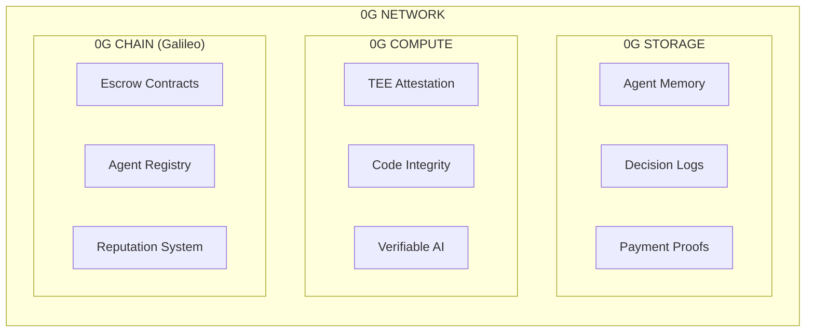
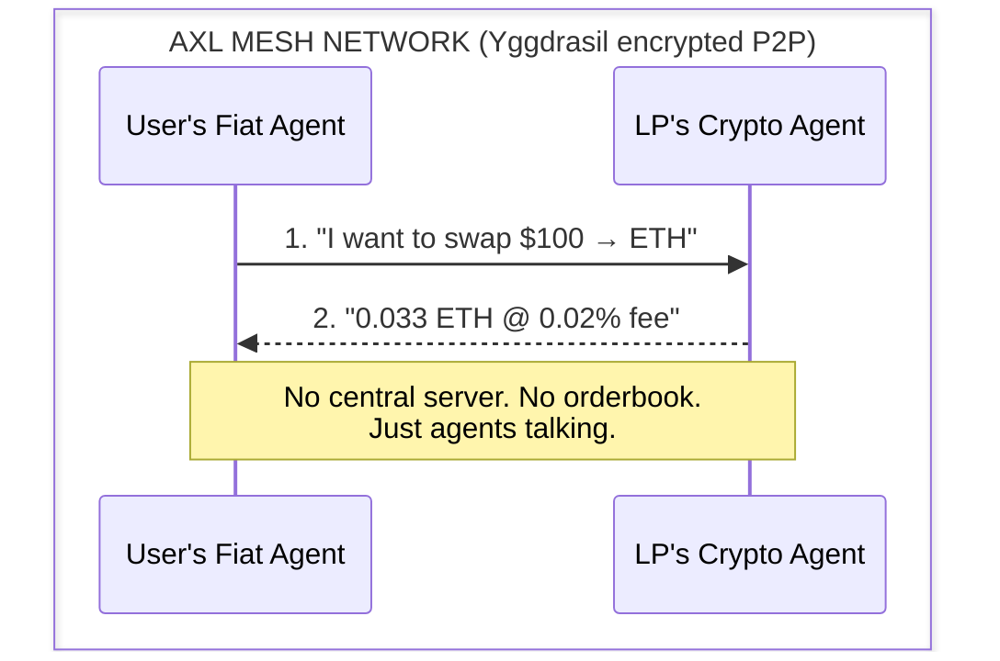
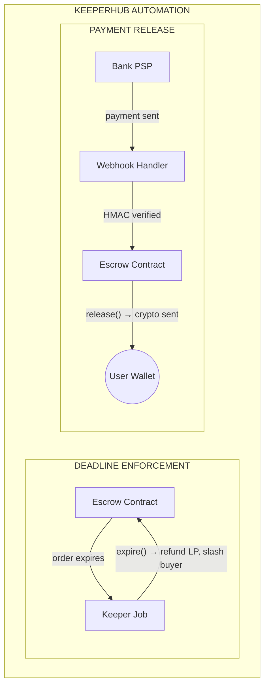
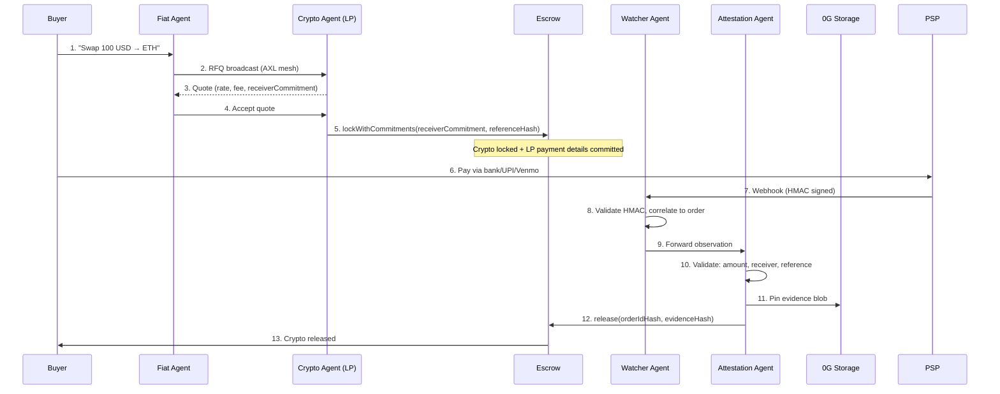
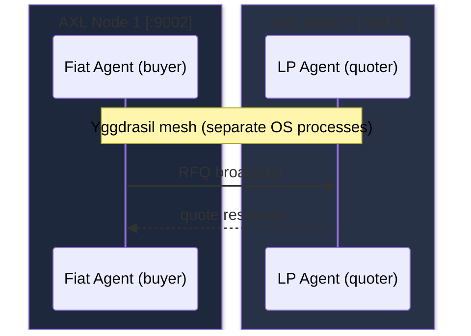

<p align="center">
  
</p>

<h1 align="center">The First Decentralized Fiat ↔ Crypto Onramp</h1>

<p align="center">
  <strong>Autonomous AI agents + zkTLS proofs + P2P negotiation.</strong><br/>
  No CEX. No custodian. No middleman.
</p>

<p align="center">
  <a href="#the-irony">The Irony</a> •
  <a href="#architecture">Architecture</a> •
  <a href="#how-aegis-uses-0g">0G</a> •
  <a href="#how-aegis-uses-gensyn-axl">AXL</a> •
  <a href="#how-aegis-uses-keeperhub">KeeperHub</a>
</p>

<p align="center">
  
  
  
  
</p>

---

## The Irony

Onboarding into crypto, DeFi, and decentralization requires you to interact with centralized servers.

**The gateway to decentralization is centralization.**

```
Coinbase       →  Custodies your funds, freezes accounts at will
Binance        →  KYC everything, banned in half the world
CoinDCX        →  Centralized order matching, withdrawal limits
MoonPay        →  5% fees, centralized verification, your data sold
```

**$50B+ flows through these centralized onramps every year.** Aegis changes that.

---

## Architecture

### G.14 Trust-Minimized Fiat Edge

Aegis uses a **4-agent model** where no single agent has unilateral release power:

```mermaid
flowchart TB
    subgraph Buyer["BUYER SIDE"]
        FA[Fiat Agent<br/>Rails & Intent]
    end
    
    subgraph LP["LP SIDE"]
        CA[Crypto Agent<br/>Quotes & Signing]
    end
    
    subgraph Settlement["SETTLEMENT LAYER"]
        WA[Watcher Agent<br/>Observe Payments]
        AA[Attestation Agent<br/>Generate Proofs]
    end
    
    FA <-->|AXL Mesh| CA
    CA -->|lock with receiverCommitment| Escrow[Escrow Contract]
    
    PSP[Bank/PSP Webhook] -->|payment event| WA
    WA -->|observation| AA
    AA -->|pin evidence| Storage["0G Storage"]
    AA -->|release(evidenceHash)| Escrow
    
    Escrow -->|crypto released| Buyer
```

**Key Safety Rule:** *Watchers observe, Attestors prove, Escrow decides.*

| Agent | Role | Trust Property |
|-------|------|----------------|
| Fiat Agent | Broadcasts buyer intent, selects quotes | No custody |
| Crypto Agent | Provides liquidity, signs locks | Locks funds in escrow, not agent |
| Watcher Agent | Observes payment webhooks, validates HMAC | Cannot release — only forwards |
| Attestation Agent | Validates observations, pins proofs | Cannot release without valid evidence |

The crypto release path is **deterministic** — escrow releases only when evidence matches pre-committed `receiverCommitment` and order constraints.

---

## Components

| Component | Technology | Function |
|-----------|------------|----------|
| P2P Messaging | Gensyn AXL | Encrypted agent communication over mesh network |
| State Persistence | 0G Storage | On-chain storage for agent decisions, proofs, and LP rankings |
| Code Attestation | 0G Compute | TEE verification of agent binary integrity |
| Payment Observation | Watcher Agent | HMAC-verified webhook processing, event correlation |
| Proof Generation | Attestation Agent | Evidence validation, 0G pinning, escrow release |
| Escrow Automation | KeeperHub | Deadline enforcement, conditional triggers |
| Settlement | 0G Galileo + Base | Smart contract escrow with `receiverCommitment` binding |
| Agent Payments | x402 | HTTP-native micropayments for agent-to-agent fees |
| LP Registration | Rail Registry | Payment rail commitment hashes, ownership verification |

---

## How Aegis Uses 0G

[0G](https://0g.ai) provides the decentralized infrastructure layer — storage, compute, and settlement.



### 0G Storage

Every agent decision is logged to 0G's distributed storage network with a Merkle root hash. This creates an immutable audit trail — if an agent claims it picked LP-1 for the best rate, anyone can verify by querying the decision log.

Payment proofs work the same way: the zkTLS evidence blob is stored on 0G, and only the compact root hash is written on-chain. This keeps gas costs low while preserving full dispute evidence.

### 0G Compute

Before any agent session starts, its code hash is attested by 0G's TEE (Trusted Execution Environment) network. This proves the running binary matches the open-source release — no tampering, no hidden logic.

LP agents can also run pricing decisions through verifiable inference. The TEE signs the output, so buyers know the quoted spread came from the declared pricing model, not a manipulated one.

### 0G Chain (Galileo)

Escrow contracts, agent registration, and reputation scores live on 0G's EVM-compatible L1. When a user completes a swap, settlement happens here (or on Base, depending on destination chain preference).

---

## How Aegis Uses Gensyn AXL

[Gensyn AXL](https://docs.gensyn.ai/tech/agent-exchange-layer) is the encrypted P2P mesh that connects all agents — no central server, no orderbook.



### How It Works

Each user runs a local AXL node — a lightweight Go binary that joins the Yggdrasil mesh. NAT traversal is automatic, and all messages are end-to-end encrypted by default.

When you type "swap 100 USD → ETH", your Fiat Agent broadcasts a request-for-quote (RFQ) to the mesh. LP agents listening on that topic respond with signed quotes. Your agent scores them by rate, fee, and reputation — then commits to the best one.

### Why P2P Matters

Traditional onramps match orders on a central server. That server sees every trade, controls the orderbook, and can freeze accounts. AXL removes the server entirely — agents negotiate directly, and the only shared state is the escrow contract.

### MCP Integration

Agents expose their capabilities as [MCP](https://modelcontextprotocol.io) tools. Any agent can discover and call another agent's tools over the mesh — get a quote, check reputation, request fiat details. This enables dynamic composition without hardcoded integrations.

---

## How Aegis Uses KeeperHub

[KeeperHub](https://keeperhub.xyz) provides trustless automation — deadline enforcement, payment triggers, and conditional escrow release.



### Deadline Enforcement

A keeper job continuously monitors the escrow contract for locked orders approaching their deadline. If the buyer doesn't submit payment proof in time, the keeper automatically expires the order — refunding the LP's locked crypto and slashing the buyer's anti-grief bond.

This prevents griefing attacks where a buyer locks up LP funds with no intention of paying.

### Payment Release

When the buyer's bank confirms the fiat transfer, the payment provider sends a webhook to KeeperHub. The workflow verifies the HMAC signature, checks that amount/currency/receiver match the locked order, pins the evidence to 0G Storage, and triggers the escrow release.

The crypto moves to the buyer's wallet — no human approval needed.

### Why KeeperHub?

| Property | Benefit |
|----------|---------|
| Non-custodial | KeeperHub's wallet can only call specific contract functions — it cannot steal funds |
| Reliable | Workflows run on KeeperHub infrastructure, not user devices that might go offline |
| Auditable | Every execution is logged with a unique ID, traceable on-chain |

---

## Transaction Flow (G.14)



| Step | Agent | Action |
|------|-------|--------|
| 1-4 | Fiat + Crypto | Quote negotiation over AXL mesh |
| 5 | Crypto Agent | Lock with `receiverCommitment` binding |
| 6 | Buyer | External fiat payment |
| 7-9 | Watcher Agent | Observe, validate HMAC, forward |
| 10-12 | Attestation Agent | Validate, pin evidence, trigger release |
| 13 | Escrow Contract | Deterministic release to buyer |

---

## G.14 Key Concepts

| Concept | Description |
|---------|-------------|
| `receiverCommitment` | `keccak256(lpPaymentReceiver)` — bound at lock time, prevents bait-and-switch |
| `referenceHash` | Payment reference hash for unambiguous order matching |
| `challengeWindow` | Per-rail delay before final release (0 for instant rails like BankSim/UPI) |
| `attestationMode` | Proof type: `banksim`, `webhook`, `zktls`, `multi-attestor` |
| `evidenceHash` | 0G Storage Merkle root of pinned payment proof |

### LP Rail Registration

LPs register payment rails (UPI VPA, Venmo handle, bank account) with commitment hashes:

```
LP registers: upi:alice@okicici
  → canonicalPayload = "upi:alice@okicici"
  → receiverCommitment = keccak256(canonicalPayload)
  → stored on-chain in RailRegistry
```

When a buyer pays, the Watcher observes the payment receiver and the Attestation Agent verifies it matches the committed hash — preventing LP from showing fake payment details.

---

## Security Model

| Concern | Mitigation |
|---------|------------|
| Agent tampering | 0G Compute TEE attests code hash before each session |
| Decision disputes | All agent decisions logged to 0G Storage with cryptographic proofs |
| Fund custody | Agents hold signing keys for broadcast only; escrow withdrawal requires valid proof or timeout |
| Fiat verification | Watcher validates HMAC, Attestor validates constraints, evidence pinned to 0G |
| LP bait-and-switch | `receiverCommitment` bound at lock time — cannot change payment target mid-order |
| Watcher collusion | Watcher cannot release — can only forward observations to Attestor |
| Attestor collusion | Attestor cannot release without evidence matching committed constraints |

---

## Deployed Contracts

### V2 Contracts (G.14 — with receiverCommitment)

| Contract | 0G Galileo | Base Sepolia |
|----------|------------|--------------|
| Escrow | `0xeAD29cBf...` | `0x42A50591...` |
| RailRegistry | `0x0a22b6e2...` | `0x8E55f999...` |
| AgentRegistry | `0x2E124DEa...` | `0xf03F328b...` |
| BankSimVerifier | `0x9401FCe4...` | `0x8AD91327...` |
| TestERC20 | `0x5F257767...` | `0xDDDfdd3D...` |

**Verified Transactions:**

| Description | Hash | Network |
|-------------|------|---------|
| G.14 lockWithCommitments | [`0xc2c6d576...`](https://chainscan-galileo.0g.ai/tx/0xc2c6d576d501cd392bcb060f1336468032abca8c4bd13991455311964f5a0c2d) | 0G Galileo |
| Evidence pin (0G Storage) | [`0x294f1c7c...`](https://chainscan-galileo.0g.ai/tx/0x294f1c7cd769a410b5a81ab024d5aa33987cce33ca0fd88bc2ad9055173e8675) | 0G Galileo |
| Escrow release | [`0x8178fde9...`](https://chainscan-galileo.0g.ai/tx/0x8178fde9db6e87206b28ec49516be22bf53c33fcda7cf454d2ac3dfede1a5801) | 0G Galileo |

---

## Local Development

```bash
git clone https://github.com/arko05roy/Aegis.git && cd Aegis
pnpm install
cp .env.example .env  # add PRIVATE_KEY

# Start AXL mesh (2 nodes)
cd services/axl-node
./node -config node-config.json &
./node -config node-config-2.json &

# Start backend
pnpm run agent-server &
pnpm run webhook-receiver &

# Start frontend
pnpm dev

# Open http://localhost:3000/p2p
```

---

## Demo

**Video:** [Watch on YouTube](https://youtube.com/watch?v=XXXXX) *(under 3 mins)*

**Live Demo:** [aegis-ten-hazel.vercel.app](https://aegis-ten-hazel.vercel.app)

---

## SDKs & Protocol Features Used

### 0G
| SDK | Version | Usage |
|-----|---------|-------|
| `@0gfoundation/0g-ts-sdk` | ^1.2.6 | Storage client for agent memory and proof pinning |
| `@0glabs/0g-serving-broker` | ^0.7.5 | Compute client for TEE attestation and verifiable inference |
| 0G Chain (Galileo) | EVM L1 | Escrow contracts, AgentRegistry, reputation |

### Gensyn AXL
| Feature | Usage |
|---------|-------|
| AXL Node (Go binary) | Local P2P mesh node per user sandbox |
| HTTP Bridge API | `/send`, `/recv`, `/topology`, `/mcp/{peer}/{svc}` |
| Yggdrasil Transport | End-to-end encrypted NAT-transparent messaging |

### KeeperHub
| Feature | Usage |
|---------|-------|
| Workflow Execution | Payment release automation via webhook triggers |
| Embedded Wallet | Non-custodial contract calls for `Escrow.release()` |
| Cron Jobs | Deadline enforcement polling |

---

## Cross-Node AXL Demo

The demo runs **two separate AXL nodes** on different ports to prove real P2P communication:



**To verify:**
```bash
# Terminal 1: Start node on port 9002
cd services/axl-node && ./node -config node-config.json

# Terminal 2: Start node on port 9012
cd services/axl-node && ./node -config node-config-2.json

# Terminal 3: Run cross-node demo
pnpm run demo:axl-cross-node
```

The script logs show messages traversing the mesh between separate OS processes — not in-memory IPC.

---

## Example Agent: Fiat Agent

A working example agent that broadcasts RFQs and selects quotes:

**Location:** [`/agents/fiat-agent/index.ts`](./agents/fiat-agent/index.ts)

**What it does:**
1. Initializes with AXL bridge, 0G Storage, and 0G Compute clients
2. Broadcasts `rfq.get` messages to LP network over AXL mesh
3. Collects `quote.sign` responses with timeout
4. Scores quotes by `(rate × reputation) / fee`
5. Logs decision to 0G Storage with Merkle root
6. Commits to best quote via `order.commit`

**Run it:**
```bash
pnpm run agent:fiat --amount 100 --from USD --to ETH
```

---

## KeeperHub Feedback

### Documentation Gaps

1. **Webhook payload schema undocumented** — The `send-webhook` action accepts a body, but the exact structure expected by external receivers (headers, signing) isn't specified. We had to reverse-engineer by hitting `/echo` endpoints.

2. **Embedded wallet permissions unclear** — Docs say the wallet is "non-custodial" but don't specify how to restrict which contract functions it can call. We assumed it can call any function on whitelisted addresses.

3. **Workflow debugging** — No way to inspect intermediate state between workflow steps. When a workflow fails silently, there's no stack trace or variable dump.

### Feature Requests

1. **Typed workflow inputs** — Allow defining a JSON schema for workflow inputs so validation happens before execution, not mid-run.

2. **Retry with backoff** — Built-in retry logic for transient RPC failures. Currently we wrap every contract call in manual retry loops.

3. **Webhook signature verification** — Native HMAC verification step would save boilerplate. We wrote our own `verifyWebhookSignature()` helper.

---

## Team

**Arko Roy** — Solo Developer  
Telegram: [@arkoroy](https://t.me/arkoroy) · X: [@arko05roy](https://x.com/arko05roy)

---

## License

MIT
